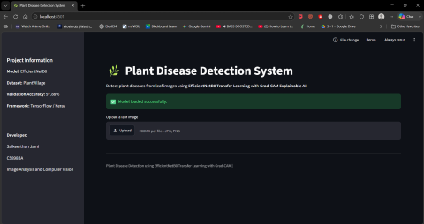
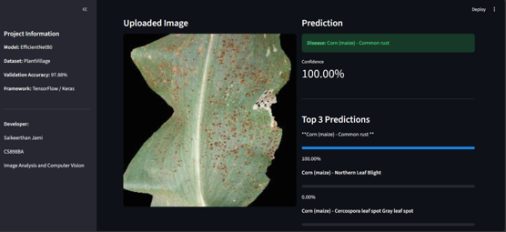
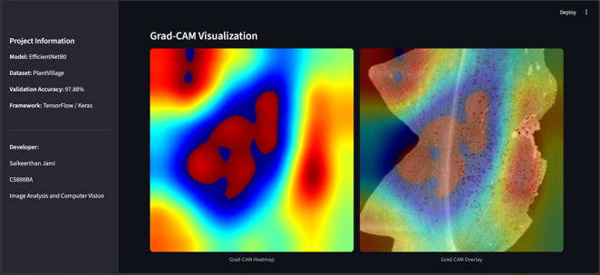
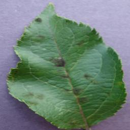

# 🌿 Plant Disease Detection Using EfficientNetB0 Transfer Learning

## CS898BA – Image Analysis & Computer Vision

### Final Project

**Student:** Saikeerthan Jami

**Instructor:** Cody Farlow


---

An end-to-end deep learning system for automated **plant disease classification** using **EfficientNetB0 Transfer Learning**, **Grad-CAM Explainable AI**, and a **Streamlit Web Application**.

---


# 📷 Demo

| Streamlit Home | Prediction | Grad-CAM |
|---------------|------------|----------|
|  |  |  |

---

# 📑 Table of Contents

- [Project Overview](#project-overview)
- [Motivation](#motivation)
- [Dataset](#dataset)
- [Project Pipeline](#project-pipeline)
- [Image Processing Pipeline](#image-processing-pipeline)
- [Model Development](#model-development)
- [Training Configuration](#training-configuration)
- [Results](#results)
- [Grad-CAM Explainability](#grad-cam-explainability)
- [Streamlit Web Application](#streamlit-web-application)
- [Repository Structure](#repository-structure)
- [Installation](#installation)
- [Usage](#usage)
- [Technologies Used](#technologies-used)
- [Future Work](#future-work)
- [References](#references)

---
# 📖 Project Overview

Plant diseases are one of the leading causes of reduced agricultural productivity, affecting both crop yield and food security worldwide. Early and accurate disease detection allows farmers to take timely corrective actions, reducing economic losses and minimizing the spread of infections.

This project presents an **end-to-end deep learning pipeline** for automated plant disease classification using the **PlantVillage dataset**. The workflow combines classical image preprocessing techniques with **EfficientNetB0 transfer learning** to accurately classify plant diseases from leaf images.

To improve model transparency, **Grad-CAM (Gradient-weighted Class Activation Mapping)** was integrated to visualize the image regions that influenced each prediction. The trained model was further deployed through a **Streamlit web application**, allowing users to upload plant leaf images and receive real-time disease predictions with confidence scores and visual explanations.

The final model achieved a **validation accuracy of 97.88%**, demonstrating the effectiveness of transfer learning for agricultural image classification tasks.

---

# 🎯 Project Objectives

The primary objectives of this project were:

- Develop an automated plant disease detection system using deep learning.
- Apply classical image preprocessing techniques to improve image quality.
- Design and evaluate a baseline Convolutional Neural Network (CNN).
- Improve classification performance using EfficientNetB0 transfer learning.
- Compare the performance of the baseline CNN and EfficientNetB0.
- Visualize model predictions using Grad-CAM.
- Deploy the trained model through a Streamlit web application.
- Provide an intuitive interface for real-time disease prediction.

---

# 💡 Motivation

Agriculture plays a critical role in ensuring global food security. However, plant diseases continue to cause substantial reductions in crop quality and yield every year. Traditional disease diagnosis relies heavily on experienced agricultural experts, making the process both time-consuming and expensive.

Recent advances in deep learning have demonstrated remarkable success in image classification tasks, making computer vision an attractive solution for automated plant disease diagnosis.

The motivation behind this project is to develop a practical, explainable, and user-friendly disease detection system that can assist farmers, researchers, and students in identifying plant diseases quickly and accurately.

Beyond achieving high classification accuracy, this project also emphasizes **model interpretability** through Grad-CAM and demonstrates how deep learning models can be deployed as interactive web applications using Streamlit.

---

# 🌱 Dataset

## PlantVillage Dataset

This project uses the publicly available **PlantVillage Dataset**, one of the most widely used benchmark datasets for plant disease classification research.

### Dataset Summary

| Property | Value |
|-----------|------:|
| Dataset | PlantVillage |
| Total Images | **54,305** |
| Number of Classes | **38** |
| Image Type | RGB Leaf Images |
| Image Size | 224 × 224 pixels |
| Dataset Split | 80% Training / 20% Validation |

The dataset contains images of healthy and diseased leaves collected under controlled laboratory conditions across multiple crop species.

### Example Disease Categories

- Apple Scab
- Apple Black Rot
- Apple Cedar Rust
- Healthy Apple
- Corn Common Rust
- Corn Northern Leaf Blight
- Grape Black Rot
- Peach Bacterial Spot
- Potato Early Blight
- Potato Late Blight
- Tomato Early Blight
- Tomato Late Blight
- Tomato Mosaic Virus
- Tomato Yellow Leaf Curl Virus
- Healthy Tomato

*(38 total disease categories)*

---

# 📂 Dataset Organization

```text
PlantVillage/
│
└── color/
    ├── Apple___Apple_scab/
    ├── Apple___Black_rot/
    ├── Apple___healthy/
    ├── Corn_(maize)___Common_rust/
    ├── Grape___Black_rot/
    ├── Potato___Late_blight/
    ├── Tomato___Early_blight/
    ├── Tomato___healthy/
    └── ...
```

During training, TensorFlow automatically loads the dataset directory, creates the training and validation splits, and converts the images into optimized `tf.data.Dataset` pipelines for efficient model training.

---

# 📊 Dataset Statistics

| Metric | Value |
|---------|------:|
| Crop Species | 14 |
| Disease Classes | 38 |
| Total Images | 54,305 |
| Training Images | ~43,000 |
| Validation Images | ~11,000 |
| Image Resolution | 224 × 224 |

The dataset provides a balanced representation of multiple crop species and disease categories, making it well suited for supervised image classification tasks.

---

# 📁 Repository Structure

The repository is organized into modular components to separate data processing, model development, evaluation, deployment, and project assets.

```text
SaikeerthanJami-CS898BA-Project/
│
├── assets/
│   ├── demo/
│   ├── pipeline/
│   ├── preprocessing/
│   └── results/
│
├── data/
│   ├── raw/
│   └── processed/
│
├── outputs/
│   ├── figures/
│   ├── gradcam/
│   ├── history/
│   ├── metadata/
│   ├── models/
│   └── reports/
│
├── src/
│   ├── evaluation/
│   ├── models/
│   ├── preprocessing/
│   ├── training/
│   ├── config.py
│   └── dataset.py
│
├── tests/
│
├── app.py
├── requirements.txt
├── README.md
├── AI_Log.md
└── .gitignore
```

---

# 🔄 Project Pipeline

The complete workflow of the project is illustrated below.

```text
                         PlantVillage Dataset
                                 │
                                 ▼
                      Image Loading & Splitting
                                 │
                                 ▼
                        Image Preprocessing
                (Resize → Blur → CLAHE → HSV)
                                 │
                                 ▼
                      TensorFlow Dataset Loader
                                 │
                                 ▼
                    EfficientNetB0 Transfer Learning
                                 │
                                 ▼
                           Model Training
                                 │
                                 ▼
                         Model Evaluation
                                 │
          ┌──────────────────────┴──────────────────────┐
          ▼                                             ▼
   Classification Report                     Confusion Matrix
          │                                             │
          └──────────────────────┬──────────────────────┘
                                 ▼
                          Grad-CAM Visualization
                                 │
                                 ▼
                      Streamlit Web Application
                                 │
                                 ▼
                       Real-Time Disease Prediction
```

This modular pipeline separates preprocessing, training, evaluation, explainability, and deployment into independent stages, making the project easier to maintain and extend.

---

# 🖼️ Image Processing Pipeline

Before training, every image undergoes several preprocessing operations designed to improve image quality and feature extraction.

The preprocessing pipeline consists of the following steps:

### 1️⃣ Image Resizing

All images are resized to **224 × 224 pixels**, matching the input size required by EfficientNetB0.

**Purpose**

- Standardizes image dimensions
- Reduces computational cost
- Ensures consistent model input

---

### 2️⃣ Gaussian Blur

Gaussian Blur removes high-frequency noise while preserving important leaf structures.

**Purpose**

- Reduce sensor noise
- Smooth image textures
- Improve feature consistency

---

### 3️⃣ CLAHE

Contrast Limited Adaptive Histogram Equalization (CLAHE) enhances local contrast without over-amplifying image noise.

**Purpose**

- Improve visibility of disease symptoms
- Enhance leaf vein structures
- Increase local contrast

---

### 4️⃣ HSV Color Space Conversion

Images are converted from RGB to HSV color space.

HSV separates brightness from color information, allowing disease-related discoloration to become more distinguishable.

**Purpose**

- Improve color-based feature extraction
- Enhance disease pattern visibility
- Reduce sensitivity to illumination changes

---

# ⚙️ Preprocessing Workflow

```text
Original Image
      │
      ▼
Resize (224×224)
      │
      ▼
Gaussian Blur
      │
      ▼
CLAHE Enhancement
      │
      ▼
HSV Conversion
      │
      ▼
TensorFlow Dataset
      │
      ▼
EfficientNetB0
```

---

# 🖼️ Preprocessing Examples

Below are examples demonstrating each preprocessing stage.

## Original Image

```markdown

```

---

## Resized Image

```markdown

```

---

## Gaussian Blur

```markdown

```

---

## CLAHE Enhancement

```markdown

```

---

## HSV Conversion

```markdown

```

> **Note:** Replace the placeholder image paths above with the actual screenshots generated by your preprocessing scripts.

---

# 📈 Why Image Preprocessing?

Although EfficientNetB0 is capable of learning robust visual features directly from RGB images, classical preprocessing techniques can improve image consistency and highlight disease-related patterns.

The preprocessing pipeline used in this project provides several advantages:

- Standardizes all input images to a fixed resolution.
- Reduces random image noise.
- Enhances local contrast for better disease visibility.
- Improves color representation through HSV transformation.
- Produces cleaner inputs for downstream deep learning models.

These preprocessing steps establish a consistent input pipeline before feature extraction using EfficientNetB0.

---

# 🧠 Model Development

To evaluate the effectiveness of transfer learning for plant disease classification, two deep learning models were developed and compared throughout this project.

The first model was a custom-built Convolutional Neural Network (CNN) that served as a performance baseline. The second model leveraged **EfficientNetB0** pretrained on the ImageNet dataset to improve feature extraction and overall classification performance.

Both models were trained using the same dataset, preprocessing pipeline, and training configuration to ensure a fair comparison.

---

# 🏗️ Baseline CNN

The baseline model is a custom Convolutional Neural Network designed specifically for multi-class plant disease classification.

The network extracts hierarchical image features using multiple convolutional layers followed by fully connected layers for classification.

## Architecture

```text
Input Image
(224 × 224 × 3)
        │
        ▼
Rescaling Layer
        │
        ▼
Conv2D (32 Filters)
        │
        ▼
MaxPooling
        │
        ▼
Conv2D (64 Filters)
        │
        ▼
MaxPooling
        │
        ▼
Conv2D (128 Filters)
        │
        ▼
MaxPooling
        │
        ▼
Flatten
        │
        ▼
Dense (128)
        │
        ▼
Dropout (0.5)
        │
        ▼
Output Layer (38 Classes)
```

---

## Model Characteristics

| Property | Value |
|-----------|------:|
| Model Type | Custom CNN |
| Input Size | 224 × 224 × 3 |
| Output Classes | 38 |
| Activation | ReLU |
| Output Activation | Softmax |
| Loss Function | Sparse Categorical Crossentropy |
| Optimizer | Adam |

---

## Baseline Performance

The baseline CNN successfully learned meaningful disease features and provided a strong starting point for comparison.

| Metric | Value |
|---------|------:|
| Validation Accuracy | **90.57%** |
| Epochs | 5 |
| Optimizer | Adam |

Although the baseline model performed well, there was still room for improvement in feature extraction and generalization.

---

# 🚀 EfficientNetB0 Transfer Learning

To improve classification performance, the baseline CNN was replaced with **EfficientNetB0**, a state-of-the-art convolutional neural network architecture developed by Google Research.

Unlike the baseline CNN, EfficientNetB0 begins with weights pretrained on the **ImageNet** dataset. Instead of learning low-level visual features from scratch, the model reuses knowledge learned from millions of natural images and adapts those features for plant disease classification.

This significantly reduces training time while improving generalization performance.

---

# 🏛️ EfficientNetB0 Architecture

```text
Input Image
(224 × 224 × 3)
        │
        ▼
EfficientNetB0
(ImageNet Weights)
        │
        ▼
Global Average Pooling
        │
        ▼
Dropout (0.3)
        │
        ▼
Dense (38)
        │
        ▼
Softmax
```

---

## Why EfficientNetB0?

EfficientNetB0 was selected because it provides an excellent balance between computational efficiency and classification accuracy.

Compared to larger architectures, EfficientNetB0 requires fewer parameters while maintaining state-of-the-art performance on many image classification benchmarks.

### Advantages

- Pretrained on over one million ImageNet images
- Excellent feature extraction capability
- Faster convergence during training
- Lower computational cost
- Better generalization
- Reduced overfitting

---

# 🔄 Transfer Learning Strategy

Transfer learning was implemented using the following approach:

1. Load EfficientNetB0 with pretrained ImageNet weights.
2. Remove the original ImageNet classification head.
3. Freeze the pretrained feature extraction layers.
4. Add a custom classification head consisting of:
   - Global Average Pooling
   - Dropout
   - Dense Softmax Output Layer
5. Train the classification head using the PlantVillage dataset.
6. Fine-tune the final layers of EfficientNetB0 using a smaller learning rate.

This strategy allows the model to retain powerful generic image features while adapting them to plant disease classification.

---

# ⚙️ Training Configuration

Both models were trained using identical training parameters to ensure a fair comparison.

| Parameter | Value |
|-----------|------:|
| Image Size | 224 × 224 |
| Batch Size | 16 |
| Epochs | 5 |
| Optimizer | Adam |
| Learning Rate | 0.001 (Baseline) |
| Fine-Tuning Learning Rate | 0.00001 |
| Loss Function | Sparse Categorical Crossentropy |
| Validation Split | 20% |

---

# 🔧 Training Callbacks

Several TensorFlow callbacks were used during training.

### ModelCheckpoint

Automatically saves the best-performing model based on validation accuracy.

### EarlyStopping

Monitors validation loss and prevents unnecessary training when performance stops improving.

### Training History

Training history is saved as JSON files for later visualization of learning curves.

---

# 📈 Model Comparison

The final comparison between both models is shown below.

| Metric | Baseline CNN | EfficientNetB0 |
|---------|-------------:|---------------:|
| Validation Accuracy | 90.57% | **97.88%** |
| Validation Loss | Higher | Lower |
| Feature Extraction | Learned from Scratch | ImageNet Transfer Learning |
| Generalization | Good | Excellent |
| Explainability | Supported | Supported with Grad-CAM |

The EfficientNetB0 model achieved an improvement of approximately **7.3 percentage points** in validation accuracy over the baseline CNN while also providing better generalization and more stable convergence.

---

# 🏆 Final Model Selection

Based on the experimental results, **EfficientNetB0** was selected as the final model for deployment because it consistently outperformed the baseline CNN across all evaluation metrics.

The final deployed system integrates:

- EfficientNetB0 Transfer Learning
- TensorFlow/Keras
- Grad-CAM Explainability
- Streamlit Web Application

This combination provides a highly accurate, interpretable, and user-friendly solution for automated plant disease classification.

---

# 📊 Results

The performance of both models was evaluated using multiple quantitative metrics, including validation accuracy, precision, recall, F1-score, confusion matrix analysis, and qualitative prediction examples.

The experimental results demonstrate that transfer learning with **EfficientNetB0** significantly improves classification performance over the baseline Convolutional Neural Network while maintaining excellent generalization across all plant disease classes.

---

# 📈 Training Performance

Both models were trained for **5 epochs** using the same preprocessing pipeline and training configuration.

The EfficientNetB0 model converged faster and achieved substantially higher validation accuracy than the baseline CNN.

## Training Accuracy

<p align="center">

</p>

The training accuracy steadily increased throughout training while the validation accuracy remained consistently high, indicating that the model generalized well to unseen data.

---

## Training Loss

<p align="center">

</p>

Both training and validation loss decreased over time, demonstrating stable convergence without evidence of significant overfitting.

---

# 🏆 Model Comparison

The following chart compares the final validation accuracy of both models.

<p align="center">

</p>

| Model | Validation Accuracy |
|---------|-------------------:|
| Baseline CNN | 90.57% |
| EfficientNetB0 | **97.88%** |

EfficientNetB0 improved the validation accuracy by approximately **7.31 percentage points**, demonstrating the effectiveness of transfer learning for plant disease classification.

---

# 📋 Final Evaluation Metrics

The final EfficientNetB0 model achieved excellent classification performance across all 38 disease categories.

| Metric | Score |
|----------|------:|
| Validation Accuracy | **97.88%** |
| Precision (Weighted) | **97.88%** |
| Recall (Weighted) | **97.88%** |
| F1 Score (Weighted) | **97.86%** |
| Number of Classes | 38 |

These metrics indicate that the model provides highly reliable predictions while maintaining balanced performance across multiple disease categories.

---

# 📉 Confusion Matrix

<p align="center">

</p>

The normalized confusion matrix illustrates the classification performance across all disease classes.

### Observations

- Most predictions lie along the main diagonal, indicating correct classifications.
- Only a small number of misclassifications occur between visually similar diseases.
- Healthy leaves are classified with very high accuracy.
- The model demonstrates strong generalization across multiple crop species.

Overall, the confusion matrix confirms the robustness of the EfficientNetB0 model.

---

# 📝 Classification Report

The classification report summarizes precision, recall, and F1-score across all classes.

### Overall Performance

| Metric | Value |
|----------|------:|
| Accuracy | **97.88%** |
| Macro Precision | **97.71%** |
| Macro Recall | **96.72%** |
| Macro F1 Score | **97.16%** |
| Weighted F1 Score | **97.86%** |

The weighted metrics indicate that the classifier performs consistently well across all disease categories while maintaining balanced precision and recall.

---

# 🔍 Sample Predictions

The trained model successfully predicts diseases from previously unseen images.

### Example 1

| Ground Truth | Prediction | Confidence |
|---------------|------------|-----------:|
| Apple___healthy | Apple___healthy | **99.89%** |

---

### Example 2

| Ground Truth | Prediction | Confidence |
|---------------|------------|-----------:|
| Apple___Black_rot | Apple___Black_rot | **96.89%** |

---

### Prediction Visualization

<p align="center">

</p>

The sample predictions demonstrate that the model is capable of accurately identifying both healthy and diseased plant leaves with high confidence.

---

# 📊 Performance Summary

| Feature | Baseline CNN | EfficientNetB0 |
|-----------|-------------:|---------------:|
| Validation Accuracy | 90.57% | **97.88%** |
| Transfer Learning | ✗ | ✓ |
| Grad-CAM Support | ✗ | ✓ |
| Streamlit Deployment | ✗ | ✓ |
| Final Deployment Model | ✗ | ✓ |

---

# 💬 Discussion

The experimental results clearly demonstrate the advantages of transfer learning for plant disease classification.

Compared with the custom CNN, EfficientNetB0 achieved:

- Higher validation accuracy
- Better feature extraction
- Faster convergence
- Improved generalization
- More stable learning
- Better prediction confidence

Furthermore, integrating **Grad-CAM** improved the interpretability of the model by allowing users to visualize which regions of the input image contributed most to the prediction.

Finally, deploying the trained model using **Streamlit** transformed the research prototype into an interactive application capable of performing real-time disease classification.

---

# 🔥 Grad-CAM Explainability

Deep learning models are often criticized as "black boxes" because they provide predictions without explaining how those decisions are made.

To improve the transparency of the proposed system, **Gradient-weighted Class Activation Mapping (Grad-CAM)** was integrated into the final EfficientNetB0 model.

Grad-CAM generates a heatmap highlighting the image regions that contributed most to the model's prediction. This allows users to verify that the model is focusing on disease symptoms rather than irrelevant background features.

---

## 🧠 How Grad-CAM Works

Grad-CAM computes the gradients of the predicted class with respect to the final convolutional feature maps of the neural network.

These gradients are then used to produce a localization heatmap showing the regions that most strongly influenced the prediction.

The workflow is illustrated below.

```text
Input Leaf Image
        │
        ▼
EfficientNetB0
        │
        ▼
Final Convolution Layer
        │
        ▼
Gradient Calculation
        │
        ▼
Heatmap Generation
        │
        ▼
Overlay on Original Image
```

The resulting visualization provides a simple yet powerful explanation of the model's decision-making process.

---

# 🌿 Grad-CAM Example

## Original Leaf

<p align="center">

</p>

---

## Generated Heatmap

<p align="center">

</p>

---

## Overlay Visualization

<p align="center">

</p>

---

## Interpretation

The Grad-CAM visualization confirms that the EfficientNetB0 model focuses primarily on diseased regions of the leaf rather than unrelated background areas.

The highlighted regions correspond closely to visible lesions, discoloration, and infected tissue, indicating that the model has learned meaningful disease-specific visual features.

This improves confidence in the model's predictions and demonstrates that the classifier is making decisions based on biologically relevant characteristics.

---

# 🌐 Streamlit Web Application

To demonstrate the practical usability of the trained model, a **Streamlit web application** was developed.

The application allows users to upload a plant leaf image and receive an immediate disease prediction along with confidence scores and Grad-CAM visualizations.

The web interface provides an intuitive way for users to interact with the trained deep learning model without requiring any knowledge of machine learning or programming.

---

# ✨ Application Features

The Streamlit application includes the following functionality:

- 📤 Upload plant leaf images
- 🌿 Automatic disease prediction
- 📈 Prediction confidence score
- 🏆 Top-3 predicted classes
- 🔥 Grad-CAM visualization
- 🖼️ Side-by-side image display
- ⚡ Fast inference using the trained EfficientNetB0 model

---

# 📱 Application Workflow

```text
Launch Application
        │
        ▼
Upload Leaf Image
        │
        ▼
Image Preprocessing
        │
        ▼
EfficientNetB0 Prediction
        │
        ▼
Display Disease Name
        │
        ▼
Show Confidence Score
        │
        ▼
Display Top-3 Predictions
        │
        ▼
Generate Grad-CAM
```

---

# 📸 Streamlit Interface

## Home Screen

<p align="center">

</p>

---

## Uploaded Image & Prediction

<p align="center">

</p>

---

## Grad-CAM Visualization

<p align="center">

</p>

---

# 🚀 Running the Web Application

The Streamlit application can be launched locally using:

```bash
python -m streamlit run app.py
```

After the application starts, open the provided local URL in your web browser.

Example:

```text
http://localhost:8501
```

Users can then upload a leaf image and receive predictions in real time.

---

# 💡 Deployment Highlights

The completed application demonstrates how deep learning models can be transformed into practical tools for real-world use.

Key deployment features include:

- End-to-end disease classification
- Interactive browser-based interface
- Explainable AI through Grad-CAM
- High prediction accuracy
- Fast inference
- Easy deployment with Streamlit

By combining EfficientNetB0, Grad-CAM, and Streamlit, this project extends beyond model development and showcases a complete machine learning application suitable for demonstration, education, and future agricultural decision-support systems.

---

# ⚙️ Installation

Follow the steps below to set up the project locally.

## 1. Clone the Repository

```bash
git clone https://github.com/JSaikeerthan/SaikeerthanJami-CS898BA-Project.git

cd SaikeerthanJami-CS898BA-Project
```

---

## 2. Create a Virtual Environment

It is recommended to use a virtual environment to isolate project dependencies.

### Windows

```bash
python -m venv venv

venv\Scripts\activate
```

### Linux / macOS

```bash
python3 -m venv venv

source venv/bin/activate
```

---

## 3. Install Dependencies

Install all required Python packages.

```bash
pip install -r requirements.txt
```

---

## 4. Verify Installation

Check that TensorFlow is installed correctly.

```bash
python -c "import tensorflow as tf; print(tf.__version__)"
```

Expected output:

```text
2.21.x
```

---

# ▶️ Usage

This repository supports multiple workflows including training, evaluation, prediction, Grad-CAM generation, and deployment through Streamlit.

---

# 🏋️ Training the Model

Train the EfficientNetB0 model using the PlantVillage dataset.

```bash
python -m src.training.train
```

During training, the following artifacts are automatically generated:

```text
outputs/
├── history/
├── models/
└── metadata/
```

Saved model:

```text
outputs/models/efficientnet_b0.keras
```

Training history:

```text
outputs/history/efficientnet_b0_history.json
```

---

# 📊 Evaluate the Model

Evaluate the trained model using the validation dataset.

```bash
python -m src.evaluation.evaluate
```

Generated outputs include:

```text
outputs/
├── reports/
│   └── classification_report.txt
│
└── figures/
    └── confusion_matrix.png
```

---

# 📈 Generate Training Curves

Generate plots for training accuracy and loss.

```bash
python -m src.evaluation.generate_plots
```

Generated figures:

```text
outputs/figures/
├── training_accuracy.png
├── training_loss.png
└── model_comparison.png
```

---

# 🔍 Predict a Plant Disease

Run inference using the trained EfficientNetB0 model.

```bash
python -m src.evaluation.predict
```

Example Output

```text
Image

Apple___Black_rot.jpg

Prediction

Apple___Black_rot

Confidence

99.94%
```

---

# 🔥 Generate Grad-CAM

Generate Grad-CAM visualizations for a prediction.

```bash
python -m src.evaluation.gradcam
```

Generated images:

```text
outputs/gradcam/
├── original.png
├── heatmap.png
└── overlay.png
```

---

# 🌐 Launch the Streamlit Application

Start the interactive web application.

```bash
python -m streamlit run app.py
```

After launching, Streamlit will provide a local URL similar to:

```text
http://localhost:8501
```

Open the URL in your browser.

---

# 🖥️ Using the Web Application

The Streamlit application provides an intuitive interface for disease classification.

## Step 1

Upload a plant leaf image.

↓

## Step 2

The uploaded image is automatically preprocessed.

↓

## Step 3

EfficientNetB0 predicts the disease class.

↓

## Step 4

The application displays:

- Predicted disease
- Confidence score
- Top-3 predictions

↓

## Step 5

Grad-CAM generates a visualization highlighting the regions that influenced the prediction.

---

# 📂 Project Outputs

Running the complete pipeline generates the following outputs.

```text
outputs/

├── figures/
│   ├── training_accuracy.png
│   ├── training_loss.png
│   ├── confusion_matrix.png
│   └── model_comparison.png
│
├── gradcam/
│   ├── original.png
│   ├── heatmap.png
│   └── overlay.png
│
├── history/
│   └── efficientnet_b0_history.json
│
├── metadata/
│   └── class_names.json
│
├── models/
│   └── efficientnet_b0.keras
│
└── reports/
    └── classification_report.txt
```

---

# 📸 Example Workflow

```text
Clone Repository

↓

Install Dependencies

↓

Train EfficientNetB0

↓

Evaluate Model

↓

Generate Training Figures

↓

Generate Grad-CAM

↓

Launch Streamlit

↓

Upload Leaf Image

↓

Receive Prediction

↓

Visualize Grad-CAM
```

---

# 💾 Saving the Trained Model

The final EfficientNetB0 model is automatically saved after training.

```text
outputs/models/efficientnet_b0.keras
```

The model can later be loaded for inference without retraining.

---

# 📦 Requirements

Major project dependencies include:

- Python 3.13
- TensorFlow 2.21
- Keras
- OpenCV
- NumPy
- Matplotlib
- Scikit-learn
- Streamlit
- Pillow
- tqdm

Install all dependencies using:

```bash
pip install -r requirements.txt
```

---

# ✅ Reproducing the Results

To reproduce the complete project from scratch, execute the following commands in order:

```bash
git clone https://github.com/JSaikeerthan/SaikeerthanJami-CS898BA-Project.git

cd SaikeerthanJami-CS898BA-Project

python -m venv venv

venv\Scripts\activate

pip install -r requirements.txt

python -m src.training.train

python -m src.evaluation.evaluate

python -m src.evaluation.generate_plots

python -m streamlit run app.py
```

Following these steps will reproduce the complete training pipeline, evaluation results, visualizations, and interactive web application.

---

# 🛠️ Technologies Used

This project combines modern deep learning, computer vision, and web application frameworks to build a complete plant disease detection system.

| Category | Technologies |
|----------|--------------|
| Programming Language | Python 3.13 |
| Deep Learning | TensorFlow 2.21, Keras |
| Computer Vision | OpenCV |
| Scientific Computing | NumPy |
| Machine Learning | Scikit-learn |
| Visualization | Matplotlib |
| Web Application | Streamlit |
| Image Processing | Pillow |
| Progress Monitoring | tqdm |
| Version Control | Git, GitHub |
| Development Environment | Visual Studio Code |

---

# 💻 Hardware & Software Environment

The project was developed and tested using the following environment.

## Hardware

| Component | Specification |
|----------|----------------|
| Laptop | HP Victus 15 |
| Processor | AMD Ryzen 5 7535HS |
| RAM | 16 GB DDR5 |
| GPU | NVIDIA GeForce RTX 2050 (4 GB) |
| Storage | 1 TB NVMe SSD |

## Software

| Component | Version |
|----------|---------|
| Operating System | Windows 11 |
| Python | 3.13 |
| TensorFlow | 2.21 |
| CUDA | 13.1 (Installed) |
| IDE | Visual Studio Code |

> **Note:** TensorFlow 2.11+ does not currently support native GPU acceleration on Windows. As a result, model training was performed on the CPU.

---

# 🚀 Future Work

Although the proposed system achieved excellent performance, several enhancements could further improve its real-world applicability.

## Short-Term Improvements

- Evaluate the model using real-world field images.
- Apply advanced data augmentation techniques.
- Experiment with additional transfer learning architectures such as EfficientNetV2 and ConvNeXt.
- Optimize inference speed for edge devices.

## Long-Term Improvements

- Develop a mobile application for disease detection.
- Deploy the application using cloud services.
- Support additional crop species.
- Implement real-time disease detection from live camera feeds.
- Extend the system to estimate disease severity.
- Integrate object detection and leaf segmentation.

---

# 📚 References

1. Mohanty, S. P., Hughes, D. P., & Salathé, M. (2016). *Using Deep Learning for Image-Based Plant Disease Detection*. Frontiers in Plant Science, 7, 1419.

2. Ferentinos, K. P. (2018). *Deep Learning Models for Plant Disease Detection and Diagnosis*. Computers and Electronics in Agriculture, 145, 311–318.

3. Too, E. C., Yujian, L., Njuki, S., & Yingchun, L. (2019). *A Comparative Study of Fine-Tuning Deep Learning Models for Plant Disease Identification*. Computers and Electronics in Agriculture, 161, 272–279.

4. Hughes, D. P., & Salathé, M. (2015). *An Open Access Repository of Images on Plant Health to Enable the Development of Mobile Disease Diagnostics*.

5. TensorFlow Documentation  
https://www.tensorflow.org/

6. OpenCV Documentation  
https://opencv.org/

7. Streamlit Documentation  
https://streamlit.io/

---

# 📌 Repository Features

This repository contains a complete deep learning pipeline for plant disease detection.

### Included Components

- Image preprocessing pipeline
- Baseline CNN implementation
- EfficientNetB0 transfer learning
- Training pipeline
- Model evaluation
- Classification report generation
- Confusion matrix visualization
- Training history visualization
- Grad-CAM explainability
- Streamlit web application
- Complete project documentation

---

# 📊 Final Project Summary

| Feature | Status |
|----------|:------:|
| Dataset Preparation | ✅ |
| Image Preprocessing | ✅ |
| Baseline CNN | ✅ |
| EfficientNetB0 Transfer Learning | ✅ |
| Training Pipeline | ✅ |
| Model Evaluation | ✅ |
| Classification Report | ✅ |
| Confusion Matrix | ✅ |
| Grad-CAM | ✅ |
| Streamlit Application | ✅ |
| Documentation | ✅ |

---

# 📈 Final Results

| Metric | Value |
|---------|------:|
| Dataset | PlantVillage |
| Images | 54,305 |
| Classes | 38 |
| Final Model | EfficientNetB0 |
| Validation Accuracy | **97.88%** |
| Weighted F1 Score | **97.86%** |
| Explainability | Grad-CAM |
| Deployment | Streamlit |

---

# 📄 License

This project was developed as part of the coursework for **CS898BA – Image Analysis & Computer Vision** at Wichita State University.

The source code is made available for educational and research purposes.

---

<p align="center">

## 🌿 Thank You!

**Questions and feedback are always welcome.**

</p>